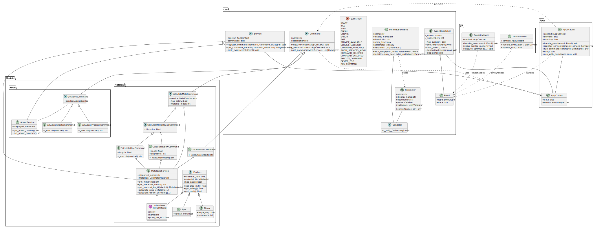

# Individual Creative Assignment: Modular Assistant

A modular assistant built with Python, featuring an event-driven architecture and a command-based extensibility system.

## 🚀 Overview

This project is a flexible, modular console application designed to handle various tasks through specialized services. It utilizes a core engine that manages events and service lifecycles, allowing for easy expansion with new functionalities.

### Key Features
- **Event-Driven Architecture**: Uses a global `EventDispatcher` to decouple components and manage application flow.
- **Modular Design**: Services and commands can be registered dynamically.
- **Command Pattern**: All user actions are encapsulated in command objects.
- **Built-in Translator**: Integration with LibreTranslate for multi-language support.
- **Easter Eggs**: Secret triggers integrated into the event system.

## 🏗️ Architecture

The project is divided into several logical layers:

- **Core**: Contains abstract base classes (`Command`, `Service`) and the event system (`Event`, `EventDispatcher`).
- **App**: Manages the application state and service registration.
- **UI**: Handles user interaction through a console-based interface.
- **Modules**: Independent features like `Translator` and `About`.
- **Utils**: Helper components like `TriggerListener` for monitoring event sequences.

### UML Diagram


Detailed architecture can be found in `doc/main.puml` (PlantUML) and `doc/main.mmd` (Mermaid).

## 🛠️ Modules

### 1. Translator Helper
A service that provides translation capabilities using the LibreTranslate API.
- **Features**:
  - Text translation between supported languages (English, Ukrainian, German, French, Polish, Spanish).
  - Language detection.
  - Translation history management.
  - Source/Target language configuration.

### 2. About Service
Provides information about the application and its creator.
- **Developer**: Yuriy Oleksandrovych Kruchkivskyi (Group B25_F3(A)).

## ⚙️ Installation & Setup

### Prerequisites
- Python 3.x
- Docker (for LibreTranslate service)

### Running LibreTranslate
The translator module requires a local LibreTranslate instance. You can start it using Docker:
```bash
docker-compose up -d
```

### Running the Application
1. Install dependencies:
   ```bash
   pip install -r requirements.txt
   ```
2. Start the main application:
   ```bash
   python main.py
   ```

## 📝 Configuration
The translator defaults to `http://localhost:5000`. Ensure the Docker container is running before starting the application.

---
*Created as an Individual Creative Assignment.*